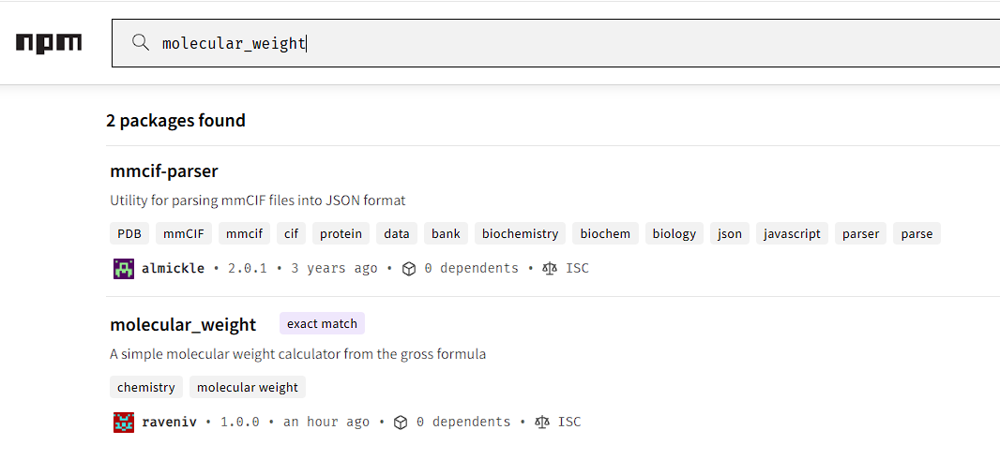
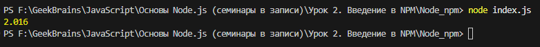

# Урок 2. Введение в NPM #

<i>Написать свою собственную библиотеку и опубликовать в NPM</i>

Создал библиотеку molecular_weight и опубликовал её на
[https://www.npmjs.com/](https://www.npmjs.com/).

Подключил библиотеку <code>npm install molecular_weight</code>

Создал простейший index.js

<code>const atomic = require('molecular_weight');

console.log(atomic.calc("H2"));</code>

Результат:

